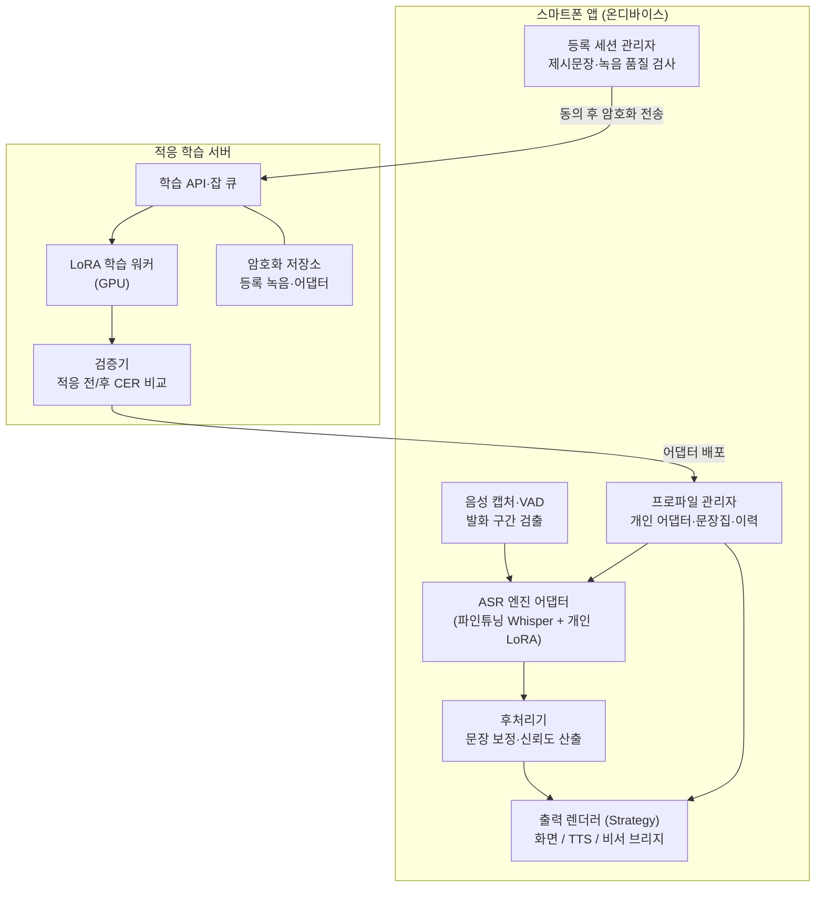
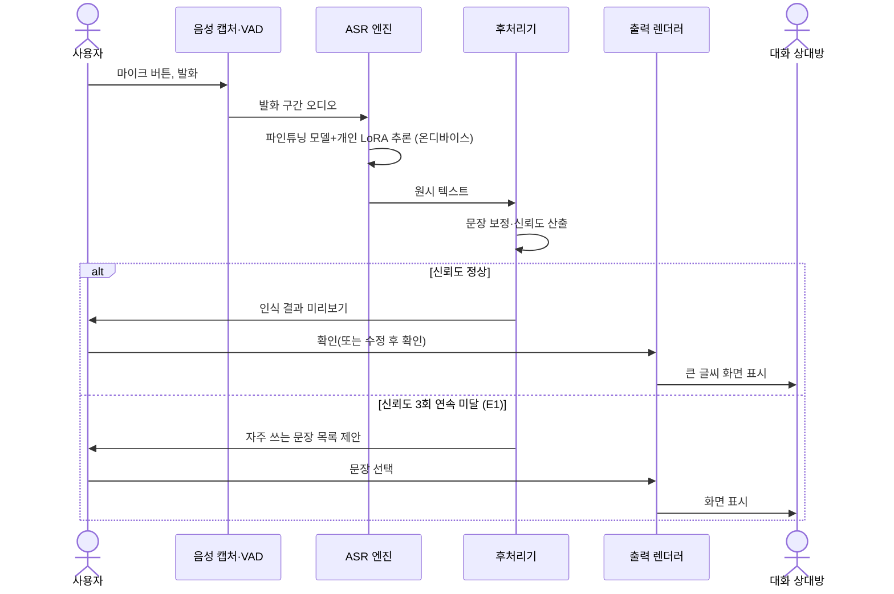
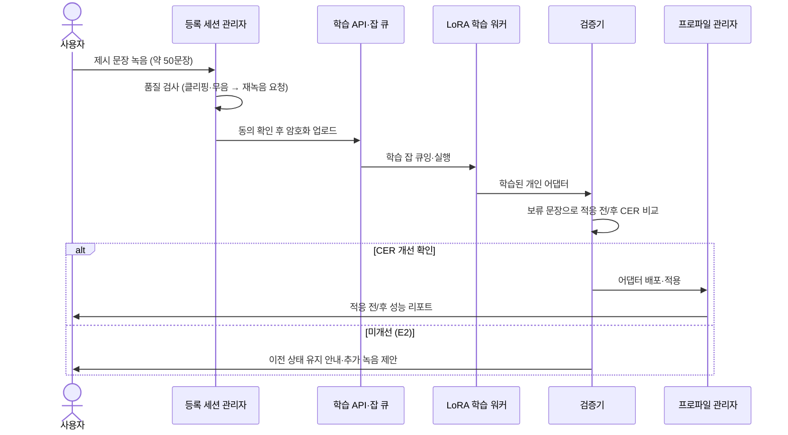
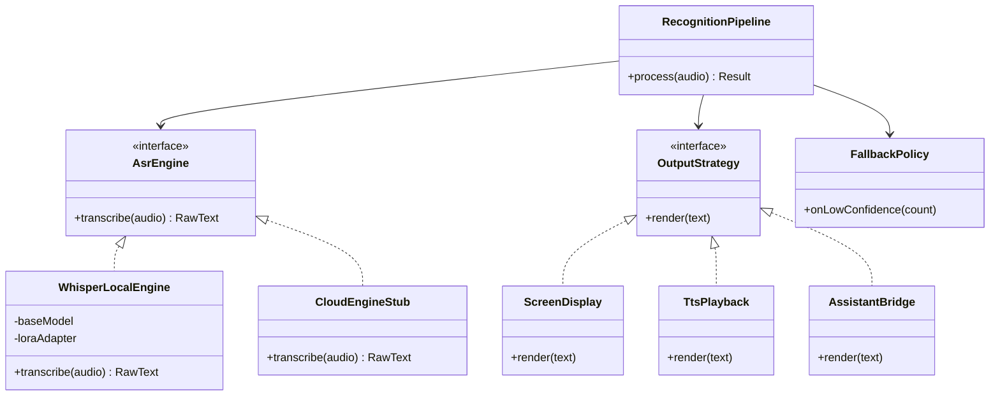

# 소프트웨어 아키텍처 명세서

**프로젝트명:** 온음(Oneum) — 구음장애인을 위한 개인화 한국어 음성 통역 서비스 (가칭)
**작성자:** (팀명 기입)
**작성일:** 2026-08-18
**버전:** 1.0

---

## 1. Project Overview

### 1.1 Project Background

뇌성마비·뇌졸중 후유증·파킨슨병 등으로 발음 근육 조절이 어려운 구음장애(마비말장애)인은 **인지와 언어 능력이 온전함에도** 발화가 불명확하다는 이유만으로 일상 의사소통에서 배제된다. 시리·빅스비 등 음성 비서, 은행 ARS, AI 콜봇은 모두 표준 발화로 학습되어 구음장애 발화를 인식하지 못하고, 전화에서는 상담원이 통화를 끊거나 대리인을 요구하며, 대면 상황에서는 취객이나 인지장애로 오해받는 낙인을 겪는다. 서울시 조사 기준 의사소통에 곤란을 겪는 장애인은 서울에만 약 17.6만 명(등록장애인의 44.6%)이며, 전국적으로는 언어장애 등록 2.4만 명과 뇌병변장애 23.4만 명의 상당수, 파킨슨·뇌졸중 환자까지 포함하면 실수요는 수십만 명 규모다.

기존 해결책은 이 문제를 정면으로 다루지 못한다. 통신중계서비스(손말이음센터 107)는 문자를 입력해 상담사가 대신 읽어주는 방식으로 실시간성이 떨어지고, AAC(보완대체의사소통) 앱은 미리 만든 버튼을 눌러 문장을 재생하는 방식이라 "자기 목소리로 말하는" 경험 자체를 대체하지 못한다. 해외에서 유일하게 이 접근을 시도한 구글 Project Relate는 영어권 전용으로 한국어를 지원한 적이 없으며 현재 신규 사용자 등록마저 중단된 상태다.

결정적으로, 정부는 이미 2021년 AI Hub에 구음장애 음성인식 데이터셋(화자 1,200명, 5,000시간 이상, 429GB)을 구축해 공개했으나 **이 데이터를 활용한 상용 서비스는 4년째 존재하지 않는다.** 본 프로젝트는 이 공공 데이터로 음성인식 모델(Whisper)을 파인튜닝하고, 사용자별 발화 패턴에 추가 적응시켜, 구음장애인의 발화를 실시간으로 텍스트와 정제된 음성으로 변환하는 서비스를 만든다.

차별점은 세 가지다. 첫째, 버튼 재생(AAC)이 아니라 **사용자의 실제 발화를 인식**한다. 둘째, 공용 모델이 아니라 **개인별 적응 모델**로 사람마다 다른 발화 패턴에 맞춘다. 셋째, 대면(화면 표시)·전화(정제 음성 재생)·기기(음성 비서 연결)의 세 가지 출력 모드로 의사소통이 막히는 실제 장면들을 각각 커버한다.

---

### 1.2 Stakeholder List

| Stakeholder | Description (역할 / 목적 / 관심사) |
|-------------|----------------------------------|
| 구음장애 당사자 (1차 사용자) | 경도~중등도 마비말장애인. 주문·전화·관공서 등 일상 의사소통을 타인 도움 없이 완수하는 것이 목적. 인식 정확도·응답 속도·사용 편의에 관심 |
| 대화 상대방 (2차 사용자) | 점원·상담원·공무원 등. 별도 앱 설치 없이 화면·음성으로 내용을 즉시 이해하는 것이 관심사 |
| 가족·활동지원사 | 당사자의 의사소통을 일상적으로 대신 통역해온 조력자. 통역 부담 경감과 당사자 자립에 관심 |
| 언어재활사·복지관 | 발화 훈련 전문가 및 보급 채널. 서비스가 재활 훈련과 충돌하지 않고 보완하는지, 기관 보급 가능성에 관심 |
| AI Hub (NIA) | 데이터 제공 기관. 공공 데이터의 활용 성과와 라이선스 준수에 관심 |
| 개발팀 | 공모전 마감(2026-09-11) 내 실증 데모 완성, 이후 서비스 확장이 목적 |

---

### 1.3 Business Goal List

| ID | Stakeholder | Statement | 중요도 |
|----|-------------|-----------|--------|
| BG-01 | 당사자 | 대면 상황에서 첫 발화 시도의 80% 이상이 재발화 없이 상대에게 전달된다 | 상 |
| BG-02 | 당사자 | 개인 적응 완료 후 음성인식 문자 오류율(CER)이 범용 모델 대비 상대 30% 이상 개선된다 | 상 |
| BG-03 | 당사자 | 개인 적응 등록(문장 녹음)을 30분 이내에 완료할 수 있다 | 중 |
| BG-04 | 당사자·가족 | 음성 데이터가 동의 없이 기기 밖으로 나가지 않는다는 신뢰를 준다 | 상 |
| BG-05 | 언어재활사·복지관 | 복지관 단위 보급 시 신규 사용자 온보딩을 기관 직원이 지원할 수 있을 만큼 단순하다 | 중 |
| BG-06 | 개발팀 | 2026-09-11까지 "범용 모델 vs 파인튜닝 모델" 정량 비교와 시연 가능한 프로토타입을 확보한다 | 상 |

---

## 2. System Overview

### 2.1 System Context Diagram

```mermaid
flowchart LR
    U["구음장애 당사자<br/>(스마트폰 앱)"] -->|발화 음성| SYS["온음 시스템"]
    SYS -->|텍스트 표시| P["대화 상대방"]
    SYS -->|정제 TTS 음성| P
    SYS -->|인식 텍스트 전달| VA["음성 비서·외부 기기<br/>(로드맵)"]
    U -->|등록 세션 녹음<br/>수정 피드백| SYS
    SYS -->|적응 학습 요청<br/>(동의 시)| TS["적응 학습 서버"]
    TS -->|개인 어댑터 배포| SYS
    AH["AI Hub<br/>구음장애 음성 데이터"] -.->|기반 모델 파인튜닝<br/>(개발 단계)| TS
```

---

### 2.2 System Feature List

| ID | Title | Description | 중요도 | 관련 BG |
|----|-------|-------------|--------|---------|
| SF-01 | 대면 통역 (화면 모드) | 발화를 실시간 인식해 상대방에게 큰 글씨로 표시 | 상 | BG-01, BG-02 |
| SF-02 | 개인 음성 적응 | 제시 문장 녹음으로 사용자 전용 인식 어댑터를 학습·적용 | 상 | BG-02, BG-03 |
| SF-03 | 정제 음성 재생 (전화 모드) | 인식 텍스트를 깨끗한 TTS로 재생해 통화·ARS 응대 | 중 | BG-01 |
| SF-04 | 자주 쓰는 문장 | 반복 사용하는 문장을 원터치 재생 (AAC 보완, 인식 실패 시 폴백) | 중 | BG-01 |
| SF-05 | 수정 피드백 학습 | 인식 결과를 사용자가 수정하면 해당 쌍을 적응 데이터로 축적 | 중 | BG-02 |
| SF-06 | 음성 비서 브리지 | 인식 텍스트를 OS 음성 비서·스마트홈에 전달 (로드맵) | 하 | BG-01 |

---

## 3. Architectural Driver

### 3.1 Use Case Model

#### 3.1.1 Use Case List

| ID | Title | Description | 중요도(I) | 난이도(D) | 관련 SF |
|----|-------|-------------|----------|----------|---------|
| UC-01 | 대면 대화 통역 | 매장·관공서에서 발화 → 화면 표시로 의사 전달 | 상 | 중 | SF-01, SF-04 |
| UC-02 | 개인 음성 등록·적응 | 제시 문장 녹음 → 개인 어댑터 학습 → 적용 | 상 | 상 | SF-02 |
| UC-03 | 전화 응대 | 발화 → 정제 TTS로 통화 상대에게 전달 | 중 | 상 | SF-03 |
| UC-04 | 인식 결과 수정 | 오인식 문장을 수정하고 적응 데이터로 저장 | 중 | 하 | SF-05 |
| UC-05 | 자주 쓰는 문장 재생 | 저장된 문장을 원터치로 표시·재생 | 중 | 하 | SF-04 |

---

#### 3.1.2 핵심 Use Case 상세

##### UC-01: 대면 대화 통역

**Scenario List**

| Scenario Title | Kind | Description |
|----------------|------|-------------|
| 화면 표시로 주문 완수 | 기본 | 발화 인식 → 상대방 화면 표시 → 확인 후 대화 계속 |
| (A1) 음성 재생 병행 | 선택 | 사용자가 TTS 재생을 켠 경우 화면 표시와 동시에 음성 재생 |
| (A2) 인식 결과 수정 후 표시 | 선택 | 인식 결과가 의도와 다를 때 목록에서 후보 선택 또는 직접 수정 후 표시 |
| (E1) 인식 실패 폴백 | 예외 | 3회 연속 신뢰도 미달 시 자주 쓰는 문장 목록을 즉시 제안 |
| (E2) 소음 환경 | 예외 | 주변 소음이 임계치 초과 시 마이크 근접 안내 표시 |

**기본 시나리오**

- Pre Condition

| Title | Description |
|-------|-------------|
| 적응 완료 | 사용자의 개인 어댑터가 기기에 적용되어 있다 (미적용 시 범용 파인튜닝 모델로 동작) |
| 앱 실행 | 대면 모드 화면이 열려 있다 |

- Post Condition

| Title | Description |
|-------|-------------|
| 의사 전달 완료 | 사용자의 발화 내용이 상대방에게 텍스트로 전달되었다 |
| 이력 저장 | 발화-인식 쌍이 로컬 이력에 저장되었다 (동의 시 적응 데이터로 활용) |

- Flow of Events

| Step No. | Description |
|----------|-------------|
| 1 | 사용자가 마이크 버튼을 누르고 발화한다 |
| 2 | 음성 활동 감지(VAD)가 발화 구간을 잘라낸다 |
| 3 | 온디바이스 ASR 엔진(파인튜닝 모델 + 개인 어댑터)이 텍스트로 변환한다 |
| 4 | 후처리기가 조사·띄어쓰기를 보정하고 신뢰도를 산출한다 |
| 5 | 사용자 화면에 인식 결과가 표시되고, 사용자가 확인(또는 수정)한다 |
| 6 | 상대방 방향 화면에 큰 글씨로 문장이 표시된다 |
| 7 | 발화-인식-확정 쌍이 로컬 이력에 저장된다 |

---

##### UC-02: 개인 음성 등록·적응

**Scenario List**

| Scenario Title | Kind | Description |
|----------------|------|-------------|
| 최초 등록·적응 | 기본 | 제시 문장 녹음 → 서버 학습 → 어댑터 적용 |
| (A1) 추가 적응 | 선택 | 사용 중 축적된 수정 피드백(UC-04)으로 어댑터 재학습 |
| (E1) 녹음 품질 미달 | 예외 | 클리핑·무음 감지 시 해당 문장 재녹음 요청 |
| (E2) 학습 후 성능 미개선 | 예외 | 적응 후 검증 CER이 개선되지 않으면 이전 어댑터 유지 및 안내 |

**기본 시나리오**

- Pre Condition

| Title | Description |
|-------|-------------|
| 계정·동의 | 사용자가 녹음 데이터의 학습 활용에 명시적으로 동의했다 |

- Post Condition

| Title | Description |
|-------|-------------|
| 어댑터 적용 | 사용자 전용 어댑터가 기기에 다운로드·적용되었다 |
| 성능 리포트 | 적응 전/후 인식 성능 비교가 사용자에게 표시되었다 |

- Flow of Events

| Step No. | Description |
|----------|-------------|
| 1 | 앱이 일상 표현 중심의 제시 문장(약 50문장)을 순서대로 보여준다 |
| 2 | 사용자가 문장을 읽어 녹음하고, 품질 검사기가 즉시 통과/재녹음을 판정한다 |
| 3 | 녹음 완료분이 암호화되어 적응 학습 서버로 전송된다 |
| 4 | 서버가 기반 모델 위에 개인 어댑터(LoRA)를 학습한다 |
| 5 | 서버가 보류 문장(녹음 중 학습에 쓰지 않은 검증분)으로 적응 전/후 CER을 비교한다 |
| 6 | 개선이 확인되면 어댑터가 기기로 배포되고 온디바이스 모델에 적용된다 |
| 7 | 사용자에게 적응 전/후 성능과 함께 완료가 안내된다 |

---

### 3.2 Quality Attribute Scenario

#### 3.2.1 QA Scenario List

| ID | Title | Type | 중요도(I) | 난이도(D) | 관련 UC |
|----|-------|------|----------|----------|---------|
| QA-01 | 대면 응답 지연 | 성능 | 상 | 중 | UC-01 |
| QA-02 | 개인화 인식 정확도 | 정확성 | 상 | 상 | UC-01, UC-02 |
| QA-03 | 음성 데이터 프라이버시 | 보안 | 상 | 중 | UC-01~04 |
| QA-04 | 오프라인 가용성 | 가용성 | 상 | 중 | UC-01, UC-05 |
| QA-05 | ASR 엔진 교체 용이성 | 변경 용이성 | 중 | 하 | UC-01 |
| QA-06 | 다사용자 적응 확장성 | 확장성 | 중 | 중 | UC-02 |

#### 3.2.2 QA Scenario 상세

**QA-01: 대면 응답 지연**

| 항목 | 내용 |
|------|------|
| QA Type | 성능 (Latency) |
| Description | 대면 대화는 상대방이 기다리는 상황이므로 발화 종료 후 표시까지의 지연이 대화 성립을 좌우한다 |
| Source of Stimulus | 사용자 |
| Stimulus | 10초 이내 길이의 발화를 종료함 |
| Artifact | 시스템 (온디바이스 인식 파이프라인) |
| Environment | 정상 운영, 중급 스마트폰(온디바이스), 네트워크 무관 |
| Response | VAD 종료 감지 → 인식 → 후처리 → 화면 표시 |
| Response Measure | 발화 종료 시점부터 화면 표시까지 p90 ≤ 2초 (참고: M5 Pro 개발 장비에서 whisper-small이 5초 오디오를 2.0초에 처리함을 확인) |

**QA-02: 개인화 인식 정확도**

| 항목 | 내용 |
|------|------|
| QA Type | 정확성 (Accuracy) |
| Description | 범용 모델은 구음장애 발화를 사실상 인식하지 못하므로, 파인튜닝+개인 적응의 정확도 개선이 서비스 존재 이유다 |
| Source of Stimulus | 사용자 (경도~중등도 마비말장애 화자) |
| Stimulus | 학습에 사용되지 않은(held-out) 일상 문장을 발화함 |
| Artifact | 시스템 (파인튜닝 모델 + 개인 어댑터) |
| Environment | 정상 운영, 실내 일반 소음 |
| Response | 텍스트 변환 결과 산출 |
| Response Measure | ① 파인튜닝 모델 CER이 범용 whisper-small 대비 상대 30% 이상 개선 ② 개인 적응 후 해당 화자 CER 추가 개선 확인 (held-out 화자·문장 기준으로 측정) |

**QA-03: 음성 데이터 프라이버시**

| 항목 | 내용 |
|------|------|
| QA Type | 보안·프라이버시 |
| Description | 음성은 민감한 개인정보이며, 발화 내용에는 결제·의료 정보가 섞인다. 당사자·가족의 신뢰가 보급의 전제다 |
| Source of Stimulus | 사용자 (일상 사용) |
| Stimulus | 대면·전화 모드에서 발화함 |
| Artifact | 시스템 |
| Environment | 정상 운영 |
| Response | 일상 인식은 전량 온디바이스 처리. 서버 전송은 ①등록 세션 녹음 ②명시 동의한 수정 피드백만, 전송 시 암호화 |
| Response Measure | 일상 발화 음성의 서버 전송 0건 (네트워크 로그로 검증 가능), 동의 철회 시 서버 측 개인 데이터 30일 내 파기 |

**QA-04: 오프라인 가용성**

| 항목 | 내용 |
|------|------|
| QA Type | 가용성 |
| Description | 의사소통이 막히는 장소(지하 매장, 병원, 관공서 창구)는 네트워크가 불안정한 경우가 많다 |
| Source of Stimulus | 환경 |
| Stimulus | 네트워크 완전 단절 상태에서 대면 모드를 사용함 |
| Artifact | 시스템 |
| Environment | 오프라인 |
| Response | 핵심 기능(UC-01 대면 통역, UC-05 문장 재생)이 기능 저하 없이 동작 |
| Response Measure | 비행기 모드에서 UC-01 기본 시나리오 성공률 100% (적응 학습 등 서버 기능만 지연 안내) |

**QA-05: ASR 엔진 교체 용이성**

| 항목 | 내용 |
|------|------|
| QA Type | 변경 용이성 |
| Description | 음성인식 모델은 발전 속도가 빨라(Whisper 계열, 국산 모델 등) 엔진 교체가 서비스 수명을 좌우한다 |
| Source of Stimulus | 개발팀 |
| Stimulus | 더 나은 기반 모델로 교체를 결정함 |
| Artifact | 시스템 (인식 파이프라인) |
| Environment | 개발 시점 |
| Response | ASR 엔진 인터페이스 뒤의 구현만 교체, 상위 로직(UI·후처리·출력)은 무변경 |
| Response Measure | 엔진 교체 시 수정 범위가 엔진 어댑터 모듈 1개로 한정, 회귀 테스트 통과 |

**QA-06: 다사용자 적응 확장성**

| 항목 | 내용 |
|------|------|
| QA Type | 확장성 |
| Description | 복지관 단위 보급 시 수백 명의 개인 적응 학습 요청이 몰릴 수 있다 |
| Source of Stimulus | 신규 사용자 다수 (기관 보급) |
| Stimulus | 1일 100건의 적응 학습 요청 발생 |
| Artifact | 적응 학습 서버 |
| Environment | 정상 운영 |
| Response | 학습 잡 큐잉 후 순차 처리, 사용자에게 예상 완료 시각 안내 |
| Response Measure | 요청 유실 0건, 개별 적응 학습(LoRA) 24시간 내 완료·배포 |

---

### 3.3 Constraint

| ID | Title | Description |
|----|-------|-------------|
| BC-01 | AI Hub 데이터 라이선스 | 구음장애 음성인식 데이터는 국내 활용 조건. 원본 데이터 재배포 불가, 학습된 모델 형태로만 서비스에 활용 |
| BC-02 | 공모전 일정 | 2026-09-11 접수 마감. PoC 범위는 파인튜닝 정량 비교 + 대면 모드 시연으로 한정 |
| BC-03 | 온디바이스 연산 한계 | 중급 스마트폰에서 동작해야 하므로 온디바이스 모델은 whisper-small급 이하(양자화 포함)로 제한 |
| BC-04 | 타겟 범위 | 경도~중등도 마비말장애로 한정. 중증(발화 자체가 거의 불가)은 인식 접근의 한계를 정직하게 명시하고 AAC 폴백(SF-04)으로만 지원 |
| BC-05 | 개인정보보호법 | 음성·건강 관련 정보 처리에 대한 명시적 동의 절차와 파기 정책 필수 |

---

## 4. Top Level Design

### 4.1 Structure View

#### 4.1.1 Static Structure Diagram



#### 4.1.2 Element List

| Name | Responsibility | 관련 UC/QA |
|------|----------------|------------|
| 음성 캡처·VAD | 마이크 입력에서 발화 구간을 실시간 검출·분리 | UC-01, QA-01 |
| ASR 엔진 어댑터 | 기반 모델+개인 어댑터로 음성→텍스트 변환. 엔진 구현을 인터페이스 뒤로 은닉 | UC-01, QA-01/02/05 |
| 후처리기 | 띄어쓰기·조사 보정, 신뢰도 산출, 저신뢰 폴백 트리거 | UC-01, QA-02 |
| 출력 렌더러 | 화면 표시/TTS 재생/비서 브리지를 Strategy로 전환 | UC-01/03, QA-05 |
| 프로파일 관리자 | 개인 어댑터·자주 쓰는 문장·발화 이력의 로컬 저장 관리 | UC-02/04/05, QA-03/04 |
| 등록 세션 관리자 | 제시 문장 진행, 녹음 품질 즉시 판정, 동의 관리 | UC-02, QA-03 |
| 학습 API·잡 큐 | 적응 요청 수신·큐잉·상태 조회 | UC-02, QA-06 |
| LoRA 학습 워커 | 기반 모델 위 개인 어댑터 학습 | UC-02, QA-02/06 |
| 검증기 | 보류 문장으로 적응 전/후 CER 비교, 미개선 시 배포 차단 | UC-02, QA-02 |
| 암호화 저장소 | 등록 녹음·어댑터 보관, 동의 철회 시 파기 | UC-02, QA-03 |

---

### 4.2 Behavior View

**UC-01 대면 대화 통역 Behavior Diagram**



**Behavior Description**

1. 인식·후처리·표시가 전부 온디바이스에서 완결된다 (QA-03 프라이버시, QA-04 오프라인).
2. 사용자 확인 단계를 표시 전에 두어 오인식이 그대로 상대에게 노출되는 것을 막는다 (당사자 존엄 고려).
3. 저신뢰 반복 시 AAC 폴백(자주 쓰는 문장)으로 즉시 전환해 대화가 끊기지 않게 한다.

**UC-02 개인 음성 등록·적응 Behavior Diagram**



**Behavior Description**

1. 품질 검사를 녹음 즉시 수행해 서버 왕복 없이 재녹음을 유도한다 (BG-03 30분 내 완료).
2. 검증기가 개선을 수치로 확인한 경우에만 배포한다 — "적응했더니 나빠졌다"를 구조적으로 차단 (QA-02).

---

### 4.3 Deployment View

```mermaid
flowchart LR
    subgraph PHONE["사용자 스마트폰"]
        APP2["온음 앱<br/>VAD + 양자화 Whisper-small<br/>+ 개인 LoRA + TTS"]
    end
    subgraph CLOUD["적응 학습 서버 (GPU 1대로 시작)"]
        API2["학습 API·잡 큐"]
        GPU["LoRA 학습 워커"]
        ST["암호화 저장소"]
    end
    subgraph DEV["개발 단계 (PoC)"]
        MAC["MacBook Pro M5 48GB<br/>AI Hub 서브셋 파인튜닝<br/>+ 데모 추론 서버"]
    end
    APP2 <-->|등록 녹음 업로드<br/>어댑터 다운로드 (HTTPS)| API2
    API2 --- GPU
    API2 --- ST
    MAC -.->|파인튜닝 기반 모델 제공| CLOUD
```

- **PoC(공모전) 단계**: 파인튜닝·평가·시연을 모두 개발 노트북(M5 Pro)에서 수행. 시연 앱은 노트북 로컬 추론 서버에 접속하는 웹/모바일 프로토타입.
- **서비스 단계**: 인식은 온디바이스, 적응 학습만 GPU 서버. 사용자 증가 시 학습 워커만 수평 확장 (QA-06).

---

### 4.4 Design Decision

#### 4.4.1 Design Decision List

| ID | Title | 관련 QA |
|----|-------|---------|
| DD-01 | 일상 인식을 온디바이스로, 적응 학습만 서버로 | QA-01, QA-03, QA-04 |
| DD-02 | 사용자별 전체 파인튜닝 대신 공용 기반 모델 + 개인 LoRA 어댑터 | QA-02, QA-06 |
| DD-03 | 스트리밍 인식 대신 VAD 발화 단위 인식 | QA-01, QA-02 |

---

#### 4.4.2 DD-01: 일상 인식을 온디바이스로, 적응 학습만 서버로

**Design Goal**

일상 발화에는 결제·의료 등 민감 내용이 섞이고(QA-03), 사용 장소는 네트워크가 불안정한 경우가 많다(QA-04). 동시에 대면 대화는 2초 이내 응답이 필요하다(QA-01). 인식 연산의 위치가 이 세 QA를 동시에 결정한다.

**Design Approach 비교**

| 항목 | Option A: 서버 인식 | Option B: 온디바이스 인식 + 서버는 적응 학습만 |
|------|----------|----------|
| 개요 | 음성을 서버로 스트리밍해 대형 모델로 인식 | 양자화된 소형 모델+개인 어댑터를 기기에서 실행, 서버는 등록 녹음 학습만 담당 |
| 장점 | 대형 모델 사용 가능(정확도 상한 높음), 앱 경량 | 일상 음성 외부 전송 0건, 오프라인 완전 동작, 네트워크 지연 제거 |
| 단점 | 모든 발화가 서버로 전송(프라이버시), 오프라인 불가, 왕복 지연·서버 비용 | 온디바이스 모델 크기 제약(BC-03), 기기별 성능 편차 |
| 관련 QA | QA-02에 유리 | QA-01/03/04에 유리 |

**Decision and Rationale**

- **선택:** Option B
- **이유:** QA-03(일상 발화 서버 전송 0건)과 QA-04(오프라인 100% 동작)는 Option A로는 원천적으로 달성 불가능하다. 정확도 격차는 "대형 범용 모델"이 아니라 "소형 모델의 구음장애 파인튜닝+개인 적응"이 좌우한다는 것이 이 프로젝트의 가설이며, QA-02의 측정(범용 대비 상대 30% 개선)으로 검증한다. 개인 적응 학습은 빈도가 낮고 실시간성이 없으므로 서버에 두어 기기 부담을 제거한다.

---

#### DD-02: 공용 기반 모델 + 개인 LoRA 어댑터

**Design Goal**

구음장애는 화자마다 발화 왜곡 패턴이 달라 개인화가 정확도의 핵심이다(QA-02). 동시에 기관 보급 시 수백 명의 개인화를 감당해야 한다(QA-06).

**Design Approach 비교**

| 항목 | Option A: 사용자별 전체 파인튜닝 | Option B: 공용 기반 모델 + 개인 LoRA 어댑터 |
|------|----------|----------|
| 개요 | 사용자마다 모델 전체를 재학습·저장 | AI Hub 데이터로 만든 공용 파인튜닝 모델은 고정, 사용자별로 수 MB의 어댑터만 학습 |
| 장점 | 개인화 상한이 이론상 가장 높음 | 학습 비용 수십 분의 1, 저장·배포가 어댑터 파일 하나, 기반 모델 개선 시 전 사용자 혜택 |
| 단점 | 1인당 학습 GPU 시간·저장 용량 과다, 배포 무거움 | 극단적 발화 패턴에는 어댑터 표현력 한계 가능 |
| 관련 QA | QA-02 상한 | QA-06 필수, QA-02 충분 |

**Decision and Rationale**

- **선택:** Option B
- **이유:** QA-06(1일 100건 적응, 24시간 내 완료)은 전체 파인튜닝으로는 GPU 비용상 불가능하다. LoRA는 소량 데이터(50문장) 개인화에 오히려 과적합 위험이 적고, 어댑터가 수 MB라 온디바이스 배포(DD-01)와도 맞물린다. 표현력 한계가 확인되는 화자는 추가 녹음 기반 재적응(A1 시나리오)으로 보완한다.

---

#### DD-03: 스트리밍 인식 대신 VAD 발화 단위 인식

**Design Goal**

QA-01은 "발화 종료 후 2초"를 요구한다. 단어 단위로 실시간 자막을 흘리는 스트리밍 방식과, 발화가 끝난 뒤 한 번에 인식하는 발화 단위 방식 중 선택이 필요하다.

**Design Approach 비교**

| 항목 | Option A: 스트리밍 인식 | Option B: VAD 발화 단위 인식 |
|------|----------|----------|
| 개요 | 오디오 청크를 연속 디코딩해 부분 자막 표시 | VAD로 발화 종료를 감지한 뒤 전체 구간을 일괄 인식 |
| 장점 | 체감 반응성 높음 | 문맥 전체를 보고 디코딩 → 구음장애 발화에서 정확도 유리, 구현 단순, Whisper 구조와 정합 |
| 단점 | 부분 결과 번복으로 상대방 혼란, 구현 복잡, 온디바이스 부하 큼 | 긴 발화에서 대기 발생 |
| 관련 QA | 체감 QA-01 | 실측 QA-01 + QA-02 |

**Decision and Rationale**

- **선택:** Option B
- **이유:** 구음장애 발화는 부분 청크만으로는 오인식률이 급증해 스트리밍의 부분 자막이 오히려 혼란을 준다(QA-02 저해). 발화 단위 인식은 M5 Pro 실측에서 5초 오디오 2.0초 처리로 QA-01 목표(p90 2초)를 만족하며, 사용자 확인 단계(UC-01 Step 5)와도 자연스럽게 결합한다. 10초 초과 장문은 후속 버전에서 문장 단위 분할로 보완한다.

---

## 5. Component Level Design *(Optional)*

### 5.1 인식 파이프라인 (ASR Pipeline) Design Description

**Overview**

| 항목 | 설명 |
|------|------|
| 개요 | 오디오 입력부터 출력 렌더링까지의 온디바이스 핵심 경로 |
| 관련 기능 요구사항 | SF-01, SF-03, SF-04, SF-06 |
| 관련 품질 요구사항 | QA-01, QA-02, QA-05 |

**Static Structure Diagram**



**Element List**

| Name | Responsibility |
|------|----------------|
| RecognitionPipeline | 캡처→인식→후처리→출력의 오케스트레이션 |
| AsrEngine (interface) | 인식 엔진 추상화 — 구현 교체가 상위에 영향 없도록 격리 |
| WhisperLocalEngine | 양자화 Whisper + 개인 LoRA 온디바이스 추론 (기본 구현) |
| CloudEngineStub | 향후 서버 대형 모델 실험용 구현체 (기본 비활성) |
| OutputStrategy 구현 3종 | 대면 화면 / 전화 TTS / 비서 브리지 출력 |
| FallbackPolicy | 저신뢰 연속 감지 시 자주 쓰는 문장 폴백 트리거 |

**Design Rationale**

- **Adapter + 인터페이스 분리 (AsrEngine)**: QA-05(엔진 교체 용이성)를 직접 구현. 모델 발전 시 WhisperLocalEngine만 교체하면 된다.
- **Strategy (OutputStrategy)**: 대면/전화/기기 모드는 입력·인식이 동일하고 출력만 다르다. 모드 추가(SF-06)가 기존 코드 수정 없이 구현체 추가로 끝난다.
- **FallbackPolicy 분리**: 폴백 조건(연속 3회 저신뢰)은 인터뷰·사용성 테스트로 바뀔 가능성이 커서 정책 객체로 분리했다.

---

## 6. Architecture Evaluation *(Optional)*

### 6.1 Traceability Summary

| Architectural Driver | 관련 Design Elements |
|---------------------|---------------------|
| UC-01 대면 통역 | RecognitionPipeline, VAD, WhisperLocalEngine, ScreenDisplay, FallbackPolicy (DD-01, DD-03) |
| UC-02 등록·적응 | 등록 세션 관리자, 학습 API·잡 큐, LoRA 학습 워커, 검증기 (DD-02) |
| QA-01 응답 지연 | 온디바이스 추론(DD-01), 발화 단위 인식(DD-03), M5 실측 2.0초/5초 오디오 |
| QA-02 인식 정확도 | AI Hub 파인튜닝 + 개인 LoRA(DD-02), 검증기 배포 게이트, eval_wer.py 비교 체계 |
| QA-03 프라이버시 | 온디바이스 인식(DD-01), 암호화 저장소, 동의·파기 정책 |
| QA-04 오프라인 | 온디바이스 전체 경로(DD-01), 서버 의존은 적응 학습으로 한정 |
| QA-05 엔진 교체 | AsrEngine 인터페이스 + Adapter (5.1) |
| QA-06 적응 확장 | LoRA 어댑터(DD-02), 잡 큐 + 워커 수평 확장 (4.3) |

---

*문서 끝*
