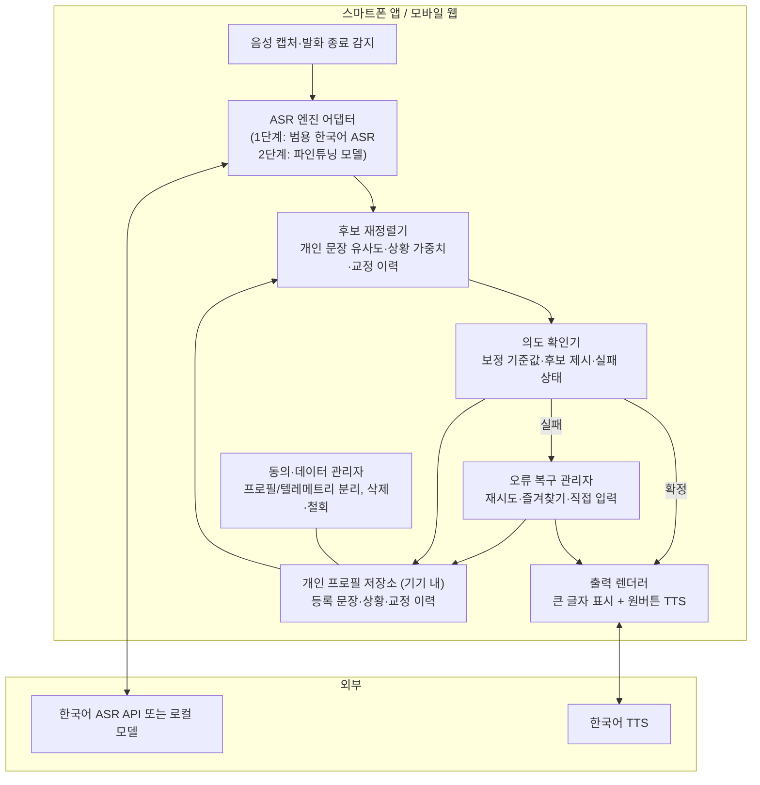
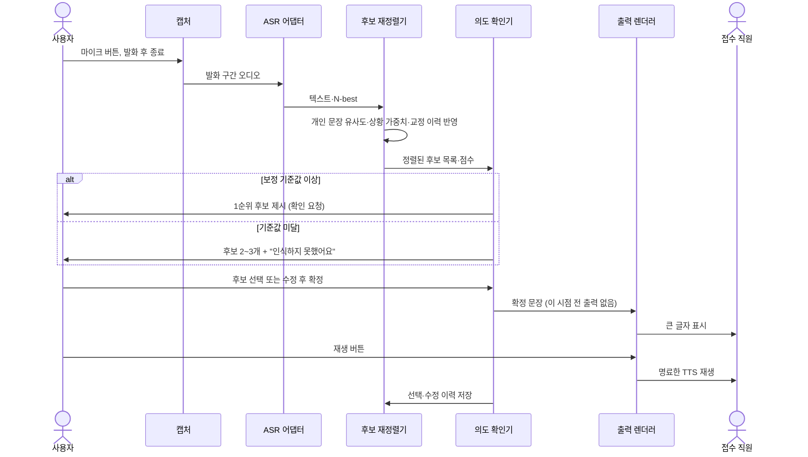
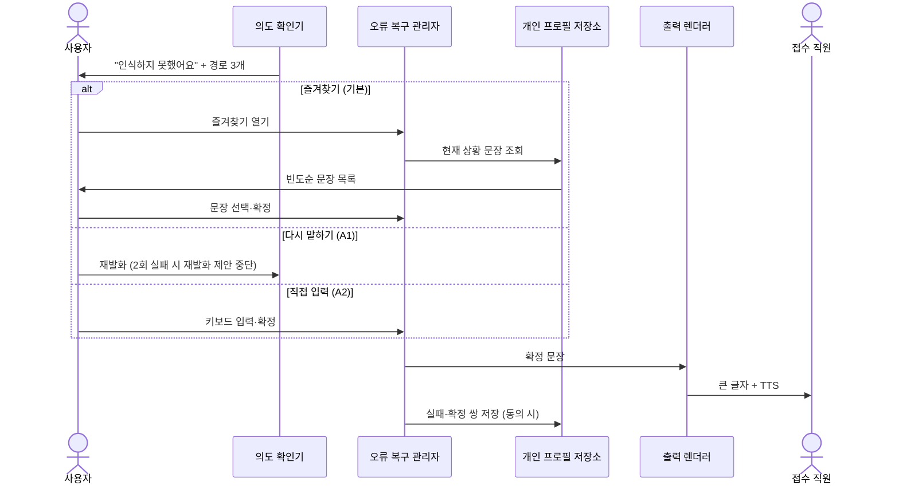
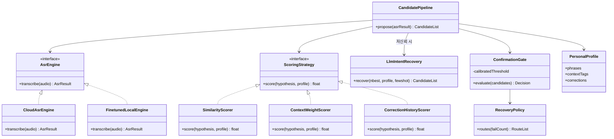
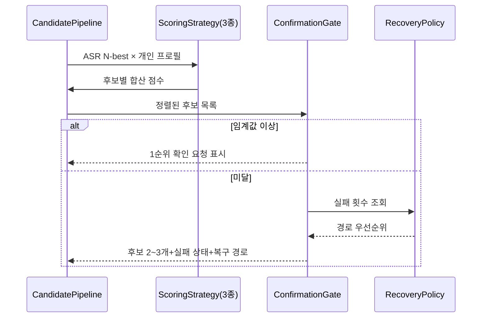

# 소프트웨어 아키텍처 명세서

**프로젝트명:** 온음(Oneum) — 의도 확인형 구음장애 의사소통 보조 서비스 (가칭)
**작성자:** (팀명 기입)
**작성일:** 2026-08-18
**버전:** 2.0 (v1 대비: 의도 확인 중심 재설계, 개인화 2단계 분리, AI Hub 데이터 접근 제약 반영, 참신성 주장 교정)

---

## 1. Project Overview

### 1.1 Project Background

뇌졸중·뇌성마비·파킨슨병 등으로 인한 구음장애(마비말장애)인은 말하고자 하는 언어적 의도가 분명함에도 발음·속도·음량·리듬의 차이 때문에 낯선 상대와 일반 음성인식기가 말을 이해하지 못한다. 같은 말을 반복하다 대화를 포기하고, 보호자가 대신 말하게 되며, 병원·관공서·매장에서 의사를 독립적으로 전달하기 어렵다. 더 위험한 것은 일반 음성인식기가 **틀린 문장을 확신 있게 출력**하는 경우로, 사용자의 의도와 다른 말이 그대로 전달될 수 있다. 실제로 미국 Speech Accessibility Project 연구에서는 일반 화자 WER 3.4%인 모델이 구음·발성장애 화자에서 36.3%로 급락했고, 장애 음성으로 미세조정한 후에도 23.7%였다(미국 영어 기준, 한국어에 그대로 일반화하지 않음).

기술적 선행은 존재한다. 2025년 국내 연구(Applied Sciences)는 한국어 구음장애 음성을 ASR로 인식해 TTS로 재생하는 실시간 시스템을 구현했고, 해외에는 비정형 음성 개인화 상용 서비스 Voiceitt가 있다. 그러나 **전자는 실사용자(장애 당사자) 평가가 없는 연구 프로토타입이며, 후자는 영어 전용으로 한국어를 지원하지 않는다.** 즉 ASR→TTS 연결 기술 자체는 새롭지 않으나, 한국어 구음장애인이 실제 생활에서 쓸 수 있는 서비스는 존재하지 않는다.

본 프로젝트의 새로움은 기술 연결이 아니라 **선행연구가 다루지 않은 지점**에 있다: ① 인식이 불확실할 때 이를 숨기지 않고 후보 문장 2~3개와 "인식하지 못했어요"를 함께 제시하는 **불확실성 공개**, ② 사용자가 선택·수정하기 전에는 절대 자동 발화하지 않는 **의도 확인 게이트**, ③ 개인이 등록한 표현과 교정 이력으로 후보 순위를 맞춤화하는 **개인 표현 프로필**, ④ 오인식 시 재시도·즐겨찾기·직접 입력으로 이어지는 **오류 복구 경로**, ⑤ 큰 버튼·한 화면 한 작업의 **접근성 설계**, ⑥ 전용 하드웨어 제작 없이 시중 블루투스 스피커(목걸이형 등)만으로 "사용자 몸에서 명료한 음성이 나오는" 경험을 구현하는 **기성품 조합 접근**(전용 목밴드 하드웨어를 개발한 해외 Revoice 연구와 대비되는 저비용 경로). 이는 의료 상황 의사소통 장애인 46명 질적 연구에서 확인된 선호 — "이해하지 못했음을 솔직히 알리기, 허락 없이 말을 추측하거나 끊지 않기" — 를 설계 원칙으로 옮긴 것이다.

이 서비스는 언어를 옮기는 "번역기"가 아니라 **"개인 맞춤형·의도 확인형 의사소통 보조 서비스"**다. 중심 문장: 우리는 AI가 구음장애인의 말을 대신 만들어 주게 하지 않는다. AI가 알아들은 후보를 보여주고, 사용자가 자신의 말을 직접 확정하게 한다.

---

### 1.2 Stakeholder List

| Stakeholder | Description (역할 / 목적 / 관심사) |
|-------------|----------------------------------|
| 구음장애 당사자 (1차 사용자) | 뇌졸중 등으로 인한 경도·중등도 구음장애 성인. 언어적 의도와 문장 구성 능력은 유지, 화면에서 후보 선택 가능. 병원 접수 등에서 의사를 독립적으로 전달하는 것이 목적 |
| 대화 상대방 (2차 사용자) | 병원 접수 직원, 매장 점원 등. 앱 설치 없이 큰 글자·명료한 음성으로 즉시 이해하는 것이 관심사 |
| 보호자·가족 | 통역을 대신해온 조력자. 부담 경감과 당사자의 통제감 회복에 관심. 필요시 후보 선택 보조 |
| 언어재활사·작업치료사·재활의학 전문가 | MVP 전 가설 보완 인터뷰 대상(당사자 경험의 대체 증거 아님), 기본 문장 20~30개 구성 자문 |
| AI Hub (NIA) | 구음장애 음성 데이터 제공 기관. IRB·소속증빙 기반 승인 절차와 라이선스 준수에 관심 |
| 개발팀 | 접수(2026-09-11)까지 기획서+의도 확인 UX 프로토타입, 본선(2026-11-04)까지 파인튜닝 실증 확보가 목적 |

---

### 1.3 Business Goal List

> 아래 정량 목표 중 표시된 항목은 선행연구 결과가 아니라 **검증 전 확정한 팀 내부 공학 목표(가설)**다.

| ID | Stakeholder | Statement | 중요도 |
|----|-------------|-----------|--------|
| BG-01 | 당사자 | 등록 문장에 대해 상위 3개 후보 안에 정답이 포함되는 비율 80% 이상 (내부 목표) | 상 |
| BG-02 | 당사자 | 발화 종료부터 후보 표시까지 중앙값 3초 이하 (내부 목표) | 상 |
| BG-03 | 당사자 | 사용자 확인 전 원치 않는 자동 발화 0건 | 상 |
| BG-04 | 당사자 | 오인식 발생 시 재시도·즐겨찾기·직접 입력으로 의사 전달을 완수할 수 있다 (전달 실패로 대화가 종료되지 않음) | 상 |
| BG-05 | 당사자·보호자 | 개인 문장·교정 기록·저장 음성을 조회·내보내기·삭제하고 동의를 철회할 수 있다 | 중 |
| BG-06 | 개발팀 | 접수 마감(9/11)까지 공식 지원서+클릭 가능한 프로토타입, 본선(11/4)까지 AI Hub 데이터 기반 파인튜닝 쌍체 비교 결과 확보 | 상 |

---

## 2. System Overview

### 2.1 System Context Diagram

```mermaid
flowchart LR
    U["구음장애 당사자<br/>(스마트폰)"] -->|발화 음성| SYS["온음 시스템"]
    SYS -->|후보 문장 2~3개<br/>+ 인식 실패 상태| U
    U -->|후보 선택·수정·확정| SYS
    SYS -->|확정 문장 큰 글자 표시<br/>+ 명료한 TTS| C["대화 상대방<br/>(병원 접수 직원 등)"]
    SYS -.->|TTS 오디오 (선택)| SPK["블루투스 스피커<br/>(목걸이형 등 기성품)"] -.-> C
    U -->|개인 표현 문장 등록<br/>(텍스트 20~30개)| SYS
    SYS <-->|발화 단위 인식 요청/결과| ASR["한국어 ASR<br/>(API 또는 로컬 모델)"]
    G["보호자"] -.->|선택 보조 (필요시)| U
    AH["AI Hub 구음장애 데이터<br/>(IRB 승인 후, 2단계)"] -.->|파인튜닝 모델| ASR
```

---

### 2.2 System Feature List

| ID | Title | Description | 중요도 | 관련 BG |
|----|-------|-------------|--------|---------|
| SF-01 | 개인 표현 프로필 | 자주 쓰는 단어·문장 20~30개 텍스트 등록, 상황별 즐겨찾기 | 상 | BG-01, BG-04 |
| SF-02 | 발화 단위 음성인식 | 한 번 말하고 끝내면 기존 한국어 ASR로 텍스트 획득 (준실시간, "실시간 통역" 아님) | 상 | BG-02 |
| SF-03 | 후보 재정렬·LLM 복원 | 1차: 개인 문장 유사도·상황 가중치·교정 이력으로 로컬 재정렬(fast path). 저신뢰 시 2차: LLM이 N-best+개인 문장+교정 이력 few-shot으로 의도 후보 2~3개 복원(slow path). LLM 생성 후보도 확정 게이트 필수 통과 | 상 | BG-01 |
| SF-04 | 의도 확인 장치 | 보정된 기준값 미달 시 후보 2~3개 + "인식하지 못했어요" 제시, 확정 전 자동 발화 금지 | 상 | BG-03, BG-04 |
| SF-05 | 오류 복구 경로 | 정답 후보 부재 시 다시 말하기 / 즐겨찾기 / 직접 입력 | 상 | BG-04 |
| SF-06 | 확정 문장 출력 | 큰 글자 표시 + 원버튼 명료 TTS 재생 | 상 | BG-03 |
| SF-07 | 교정 이력 축적 학습 | (오인식→확정) 쌍을 기기 내 축적 → ①정렬 가중치 반영 ②LLM few-shot 예시 주입 ③개인 오류 패턴 사전 자동 추출. 모델 재학습 없이 쓸수록 개인 발화 패턴에 적응 | 상 | BG-01 |
| SF-08 | 개인정보 통제 | 필수 프로필과 선택적 연구 로그 분리, 조회·삭제·동의 철회 | 중 | BG-05 |
| SF-10 | 문장 등록 도우미 (선택) | 온보딩 시 상황별(병원 등) 추천 문장을 LLM이 제안하고 사용자가 선택·수정해 등록 — 초기 등록 부담 경감 | 하 | BG-01 |
| SF-09 | 외부 스피커 출력 (선택) | 시중 블루투스 스피커(목걸이형 등) 페어링 시 TTS를 해당 기기로 재생 — "내 몸에서 목소리가 나오는" 경험. 재생 버튼 옆에 현재 출력 기기 상시 표시 | 하 | BG-03 |

---

## 3. Architectural Driver

### 3.1 Use Case Model

#### 3.1.1 Use Case List

| ID | Title | Description | 중요도(I) | 난이도(D) | 관련 SF |
|----|-------|-------------|----------|----------|---------|
| UC-01 | 병원 접수 의사 전달 | 발화 → 후보 확인 → 확정 문장을 큰 글자+TTS로 전달 | 상 | 중 | SF-02~06 |
| UC-02 | 오인식 복구 | 정답 후보가 없을 때 재시도·즐겨찾기·직접 입력으로 전달 완수 | 상 | 중 | SF-04, SF-05 |
| UC-03 | 개인 표현 프로필 등록 | 자주 쓰는 문장 20~30개 텍스트 등록·상황 분류 | 상 | 하 | SF-01 |
| UC-04 | 교정 이력 반영 | 선택·수정 이력이 다음 후보 정렬에 반영됨 확인 | 중 | 중 | SF-07 |
| UC-05 | 개인정보 관리 | 프로필·이력·저장 음성 조회, 삭제, 동의 철회 | 중 | 하 | SF-08 |

---

#### 3.1.2 핵심 Use Case 상세

##### UC-01: 병원 접수 의사 전달

**Scenario List**

| Scenario Title | Kind | Description |
|----------------|------|-------------|
| 후보 1순위 확정 전달 | 기본 | 발화 → 1순위 후보 확인 → 확정 → 표시·재생 |
| (A1) 2~3순위 후보 선택 | 선택 | 1순위가 의도와 다를 때 나머지 후보에서 선택 후 확정 |
| (A2) 후보 수정 후 확정 | 선택 | 후보 문장을 직접 일부 수정한 뒤 확정 |
| (A3) 보호자 보조 선택 | 선택 | 화면 조작이 어려운 순간 보호자가 후보 선택을 보조 |
| (A4) 블루투스 스피커 재생 | 선택 | 목걸이형 등 페어링된 스피커로 TTS 재생 — 재생 전 출력 대상 기기명이 버튼 옆에 표시됨 |
| (E1) 인식 실패 | 예외 | 기준값 미달 → "인식하지 못했어요"와 함께 UC-02(오류 복구)로 전환 |
| (E2) 네트워크 지연·단절 | 예외 | ASR 응답 지연 시 상태 표시 후 즐겨찾기·직접 입력을 즉시 제안 |

**기본 시나리오**

- Pre Condition

| Title | Description |
|-------|-------------|
| 프로필 등록 | 개인 표현 문장 20~30개가 등록되어 있다 (UC-03) |
| 상황 선택 | 사용자가 "병원" 상황을 선택했거나 기본 상황으로 설정되어 있다 |

- Post Condition

| Title | Description |
|-------|-------------|
| 의사 전달 완료 | 사용자가 확정한 문장(그리고 오직 그 문장만)이 상대에게 표시·재생되었다 |
| 이력 축적 | 선택·수정 결과가 교정 이력에 저장되었다 (다음 정렬에 반영) |

- Flow of Events

| Step No. | Description |
|----------|-------------|
| 1 | 사용자가 마이크 버튼을 누르고 한 문장을 발화한 뒤 종료한다 |
| 2 | 시스템이 발화 구간을 잘라 ASR에 전달하고 텍스트·N-best를 받는다 |
| 3 | 후보 재정렬기가 ASR 결과와 개인 문장 사전의 유사도, 상황 가중치, 교정 이력으로 후보 순위를 계산한다 |
| 4 | 의도 확인기가 보정된 기준값과 비교한다 — 기준 이상이면 1순위 후보를, 미달이면 후보 2~3개와 "인식하지 못했어요"를 제시한다 |
| 5 | 사용자가 후보를 선택하거나 수정하여 **확정**한다 (확정 전 어떤 문장도 자동 재생되지 않는다) |
| 6 | 확정 문장이 큰 글자로 표시되고, 사용자가 버튼을 누르면 명료한 TTS로 재생된다 |
| 7 | 선택·수정 결과가 교정 이력에 저장된다 |

---

##### UC-02: 오인식 복구

**Scenario List**

| Scenario Title | Kind | Description |
|----------------|------|-------------|
| 즐겨찾기로 전달 | 기본 | 후보에 정답이 없어 상황별 즐겨찾기에서 문장을 선택해 전달 |
| (A1) 다시 말하기 | 선택 | 마이크를 다시 눌러 재발화 (반복 횟수 기록) |
| (A2) 직접 입력 | 선택 | 키보드(또는 보호자 보조)로 문장을 직접 입력해 전달 |
| (E1) 반복 실패 누적 | 예외 | 재발화 2회 실패 시 재발화 제안을 중단하고 즐겨찾기·직접 입력을 앞세운다 (피로 방지) |

**기본 시나리오**

- Pre Condition

| Title | Description |
|-------|-------------|
| 인식 실패 상태 | UC-01 4단계에서 기준값 미달 또는 사용자가 "정답 없음"을 선택했다 |

- Post Condition

| Title | Description |
|-------|-------------|
| 의사 전달 완수 | ASR 성공 여부와 무관하게 사용자의 의도가 전달되었다 |
| 실패 로그 | (동의 시) 실패 발화와 최종 확정 문장 쌍이 개선용 로그에 저장되었다 |

- Flow of Events

| Step No. | Description |
|----------|-------------|
| 1 | 시스템이 "인식하지 못했어요"와 함께 3개 경로(다시 말하기 / 즐겨찾기 / 직접 입력)를 동일 화면에 제시한다 |
| 2 | 사용자가 즐겨찾기를 열면 현재 상황("병원")의 등록 문장이 사용 빈도순으로 표시된다 |
| 3 | 사용자가 문장을 선택해 확정한다 |
| 4 | 확정 문장이 큰 글자+TTS로 전달된다 (UC-01 6단계와 동일 경로) |
| 5 | 실패-확정 쌍이 교정 이력에 저장되어 다음 후보 정렬에 반영된다 |

---

### 3.2 Quality Attribute Scenario

#### 3.2.1 QA Scenario List

| ID | Title | Type | 중요도(I) | 난이도(D) | 관련 UC |
|----|-------|------|----------|----------|---------|
| QA-01 | 의도 통제 (자동 발화 금지) | 안전성 | 상 | 하 | UC-01, UC-02 |
| QA-02 | 후보 정확도 (쌍체 비교) | 정확성 | 상 | 상 | UC-01 |
| QA-03 | 후보 표시 지연 | 성능 | 상 | 중 | UC-01 |
| QA-04 | 오류 복구 가용성 | 가용성 | 상 | 중 | UC-02 |
| QA-05 | 음성·프로필 프라이버시 | 보안 | 상 | 중 | UC-01~05 |
| QA-06 | ASR 엔진 교체 용이성 | 변경 용이성 | 중 | 하 | UC-01 |

#### 3.2.2 QA Scenario 상세

**QA-01: 의도 통제 (자동 발화 금지)**

| 항목 | 내용 |
|------|------|
| QA Type | 안전성 (Safety) |
| Description | 오인식 문장이 사용자 의도로 둔갑해 전달되는 것이 이 도메인 최대 위험이다. 의료 의사소통 질적 연구(46명)에서 "허락 없이 말을 추측하지 말 것"이 당사자 선호로 확인됨 |
| Source of Stimulus | 시스템 (ASR 오인식 포함 모든 인식 결과) |
| Stimulus | 인식 결과가 산출됨 (신뢰도 높음/낮음 무관) |
| Artifact | 시스템 (출력 경로) |
| Environment | 정상 운영 전체 |
| Response | 사용자의 명시적 확정 행위가 있기 전에는 상대방 화면 표시·TTS 재생이 발생하지 않음. 재생 시 현재 오디오 출력 대상(폰/외부 스피커)이 버튼 옆에 표시되어 의도치 않은 기기로의 재생을 방지 |
| Response Measure | 사용자 확인 전 원치 않는 자동 발화 **0건** (사용성 테스트 전 과제에서 검증) |

**QA-02: 후보 정확도 (쌍체 비교)**

| 항목 | 내용 |
|------|------|
| QA Type | 정확성 |
| Description | 서비스 가치는 "일반 ASR 대비 개인화 후보 시스템이 의도를 더 잘 맞추는가"로 측정된다 |
| Source of Stimulus | 사용자 (경도·중등도 구음장애 화자) |
| Stimulus | 등록 문장에 대한 새로 수집된 검증 발화 (조용한 환경 / 생활 소음 환경 구분) |
| Artifact | 시스템 (ASR + 후보 재정렬) |
| Environment | 동일 음성 파일을 ① 일반 ASR 단독 ② 개인화 재정렬 파이프라인에 모두 입력하는 쌍체 비교 |
| Response | CER·WER, 1순위 의도 정확도, 상위 3개 후보 포함률, 인식 실패율 산출. 정답 의도는 사용자 본인 또는 지정 파트너가 확인 (개발팀 추정 금지) |
| Response Measure | 상위 3개 후보 포함률 80% 이상 (검증 전 확정한 내부 공학 목표 — 선행연구 수치 아님) |

**QA-03: 후보 표시 지연**

| 항목 | 내용 |
|------|------|
| QA Type | 성능 (Latency) |
| Description | 상대가 기다리는 대면 상황이므로 발화 종료 후 후보 표시까지의 지연이 사용 가능성을 좌우한다. TTS 출력까지의 전체 시간과 분리 측정한다 |
| Source of Stimulus | 사용자 |
| Stimulus | 10초 이내 발화를 종료함 |
| Artifact | 시스템 (인식·재정렬 경로) |
| Environment | 정상 운영, 일반 LTE/Wi-Fi (클라우드 ASR 사용 시) |
| Response | 발화 종료 감지 → 인식 → 재정렬 → 후보 표시 |
| Response Measure | 후보 표시 지연 중앙값 3초 이하 (내부 공학 목표). 개발 장비 참고 실측: 로컬 whisper-small이 5초 오디오를 2.0초에 처리 (M5 Pro) |

**QA-04: 오류 복구 가용성**

| 항목 | 내용 |
|------|------|
| QA Type | 가용성 |
| Description | 상위 3개 후보에 정답이 없거나 네트워크·소음으로 인식이 불가능한 상황에서도 대화가 끊기면 안 된다 |
| Source of Stimulus | 환경·시스템 (후보 없음, 네트워크 지연·단절, 배경 소음) |
| Stimulus | 인식 실패 또는 ASR 무응답 발생 |
| Artifact | 시스템 |
| Environment | 비정상 상황 포함 전체 |
| Response | "인식하지 못했어요" 상태 공개와 함께 다시 말하기·즐겨찾기·직접 입력 경로를 즉시 제공. 즐겨찾기·직접 입력은 ASR 없이 동작 |
| Response Measure | 인식 실패 상황에서 대체 경로를 통한 의사 전달 완수율 100% (사용성 테스트 과제 기준), 오인식 후 교정 전달 비율·교정 시간 측정 |

**QA-05: 음성·프로필 프라이버시**

| 항목 | 내용 |
|------|------|
| QA Type | 보안·프라이버시 |
| Description | 개인 문장·음성은 민감정보다. 클라우드 ASR 사용 시 전송 사실을 숨기지 않는다 ("완전 익명·무저장" 단정 금지 — 처리업체 확정 전) |
| Source of Stimulus | 사용자 (일상 사용, 동의 관리) |
| Stimulus | 발화 인식 요청 / 동의 철회 요청 |
| Artifact | 시스템 |
| Environment | 정상 운영 |
| Response | 개인 문장·우선순위는 기기 내 저장 우선. 원본 음성은 추론 후 삭제가 기본, 연구용 보관은 별도 명시 동의. 클라우드 ASR 사용 시 전송 사실·처리업체·암호화를 고지. 필수 프로필과 선택 텔레메트리 분리 — 텔레메트리 거부 시에도 핵심 기능 동작 |
| Response Measure | 동의 없는 음성 보관 0건, 철회 시 대상 데이터 삭제 완료, 텔레메트리 거부 상태에서 UC-01/02 정상 수행 |

**QA-06: ASR 엔진 교체 용이성**

| 항목 | 내용 |
|------|------|
| QA Type | 변경 용이성 |
| Description | 1단계(범용 한국어 ASR)에서 2단계(AI Hub 데이터 파인튜닝 모델, 본선 목표)로 엔진을 교체해도 제품 로직이 흔들리면 안 된다 |
| Source of Stimulus | 개발팀 |
| Stimulus | 파인튜닝 모델 준비 완료로 엔진 교체를 결정함 |
| Artifact | 시스템 (인식 파이프라인) |
| Environment | 개발 시점 |
| Response | AsrEngine 인터페이스 뒤의 구현체만 교체, 재정렬·확인·출력 로직 무변경 |
| Response Measure | 교체 수정 범위가 엔진 어댑터 1개 모듈로 한정, 동일 검증 세트로 쌍체 비교 재실행 가능 |

---

### 3.3 Constraint

| ID | Title | Description |
|----|-------|-------------|
| BC-01 | AI Hub 데이터 접근 절차 | 구음장애 음성인식 데이터(2021, 2025-03 갱신)는 보건의료 분류로 **IRB 심의결과 통지서+소속증빙 제출 후 승인**되어야 다운로드 가능. 따라서 접수(9/11)용 MVP는 이 데이터에 의존하지 않도록 설계하고, 파인튜닝은 본선(11/4) 목표의 2단계로 분리한다. 데이터는 낭독 중심(자유발화 0.14%)이므로 실대화 일반화에는 별도 검증이 필요함을 명시한다 |
| BC-02 | 일정 | 접수 2026-09-11: 공식 지원서(A4 11pt 5쪽) + 클릭 가능한 의도 확인 UX 프로토타입. 본선 2026-11-04: 파인튜닝 쌍체 비교 실증 목표 |
| BC-03 | 타겟·사용 상황 한정 | 첫 대상은 언어적 의도가 유지되고 화면 선택이 가능한 경도·중등도 성인. 첫 상황은 병원 접수·기본 요구 전달. 응급상황, 투약·수술 동의, 진단 설명 등 오류 비용이 큰 의료 의사결정에는 사용하지 않음을 명시 |
| BC-04 | 표현 원칙 | "실시간 통역"이 아닌 "준실시간 발화 단위 변환"으로 표현. ASR→TTS 자체의 최초성 주장 금지(2025 국내 연구 존재). MVP에서 20~30문장으로 개인 모델을 재학습한다고 주장하지 않음 |
| BC-05 | 개인정보보호법 | 음성·건강 관련 정보의 수집·이용 동의, 보관·파기 정책, 처리위탁 고지 필수 |
| BC-06 | 검증 윤리 | MVP 전 당사자 직접 인터뷰가 어렵다는 제약을 숨기지 않는다. 전문가·보호자 인터뷰(5~10건)는 가설 보완용이며 당사자 검증으로 포장하지 않는다. MVP 후 당사자 3~5명 테스트는 형성적 사용성 평가로만 해석한다 |

---

## 4. Top Level Design

### 4.1 Structure View

#### 4.1.1 Static Structure Diagram



#### 4.1.2 Element List

| Name | Responsibility | 관련 UC/QA |
|------|----------------|------------|
| 음성 캡처·발화 종료 감지 | 마이크 입력, 발화 단위 구간 확정 (충분한 입력 시간 허용) | UC-01, QA-03 |
| ASR 엔진 어댑터 | 인식 요청·N-best 수신을 인터페이스 뒤로 은닉. 1단계 범용 ASR → 2단계 파인튜닝 모델 교체 지점 | UC-01, QA-03/06 |
| 후보 재정렬기 | fast path: 로컬 유사도·가중치 재정렬 / slow path(저신뢰 시): LLM 의도 복원 — N-best+개인 문장+최근 교정 쌍 few-shot 주입. 생성 후보는 '제안' 라벨로 게이트에 전달 | UC-01/04, QA-02/03 |
| 의도 확인기 | 별도 검증 발화로 보정한 기준값 판정, 후보 2~3개+실패 상태 제시, **확정 전 출력 차단** | UC-01, QA-01/02 |
| 오류 복구 관리자 | 다시 말하기·즐겨찾기·직접 입력 경로 제공, 재발화 실패 누적 시 경로 우선순위 조정 | UC-02, QA-04 |
| 출력 렌더러 | 확정 문장의 큰 글자 표시와 원버튼 TTS 재생 (자동 재생 없음). 현재 오디오 출력 대상(폰/블루투스 스피커) 상시 표시로 오출력 방지 | UC-01/02, QA-01 |
| 개인 프로필 저장소 | 등록 문장·상황 분류·교정 이력의 기기 내 저장 | UC-03/04, QA-02/05 |
| 동의·데이터 관리자 | 필수 프로필/선택 텔레메트리 분리, 원본 음성 추론 후 삭제, 조회·삭제·철회 | UC-05, QA-05 |

---

### 4.2 Behavior View

**UC-01 병원 접수 의사 전달 Behavior Diagram**



**Behavior Description**

1. 모든 출력은 사용자의 확정 행위 뒤에만 발생한다 — 의도 확인기가 출력 경로의 유일한 관문이다 (QA-01).
2. 재정렬은 모델 재학습이 아니라 검색·가중치 계산이므로 MVP에서 기술 리스크 없이 동작한다 (BC-04).
3. 교정 이력이 다음 발화의 후보 순위에 반영되어 쓸수록 1순위 적중이 늘어나는 구조다 (QA-02).

**UC-02 오인식 복구 Behavior Diagram**



**Behavior Description**

1. 즐겨찾기·직접 입력은 ASR 없이 동작하므로 네트워크 단절·소음 환경에서도 의사 전달이 완수된다 (QA-04).
2. 재발화 2회 실패 시 재발화를 더 권하지 않는다 — 반복 발화가 곧 피로·좌절이라는 당사자 연구 결과를 반영한 정책이다.

---

### 4.3 Deployment View

```mermaid
flowchart LR
    subgraph P1["1단계: 접수용 MVP (~9/11)"]
        WEB["모바일 웹 프로토타입<br/>캡처·재정렬·확인·출력 전부 클라이언트"]
        BE["경량 백엔드 (선택)<br/>ASR API 프록시·키 보호"]
        CLOUDASR["상용 한국어 ASR API<br/>(N-best·비용·개인정보 비교 후 선정)"]
        WEB <--> BE <--> CLOUDASR
    end
    subgraph P2["2단계: 본선 실증 (~11/4)"]
        MAC["개발 노트북 M5 Pro 48GB<br/>AI Hub 데이터 파인튜닝(IRB 승인 후)<br/>+ 로컬 추론 서버로 데모"]
    end
    P1 -.->|엔진 어댑터 교체 (QA-06)| P2
```

- **1단계**: 개인 프로필·교정 이력은 기기(브라우저 로컬 저장) 안에 둔다. ASR만 외부 API를 쓰며 전송 사실을 UI에 고지한다 (QA-05).
- **2단계**: IRB 면제확인 → AI Hub 승인 → 파인튜닝(파이프라인 구축 완료: uv+PyTorch MPS, whisper-small 실측 완료) → 동일 검증 세트로 쌍체 비교 → 엔진 어댑터만 교체해 데모.

---

### 4.4 Design Decision

#### 4.4.1 Design Decision List

| ID | Title | 관련 QA |
|----|-------|---------|
| DD-01 | MVP 개인화를 모델 미세조정 대신 후보 재정렬로 구현 | QA-02, QA-06 (+BC-01/04) |
| DD-02 | 자동 발화 대신 사용자 확정 게이트 | QA-01, QA-04 |
| DD-03 | 스트리밍 대신 발화 단위 인식 (준실시간) | QA-02, QA-03 |
| DD-04 | 개인 적응을 재학습이 아닌 교정 이력 few-shot 루프로 구현 | QA-02, QA-03, QA-05 |

---

#### 4.4.2 DD-01: MVP 개인화를 모델 미세조정 대신 후보 재정렬로 구현

**Design Goal**

개인화는 이 서비스의 핵심 가치(QA-02)지만, AI Hub 데이터는 IRB 승인 전 사용 불가(BC-01)이고 20~30문장으로 개인 모델을 재학습한다는 주장은 기술적으로 정직하지 않다(BC-04). 접수 일정(BC-02) 안에 검증 가능한 개인화 방식이 필요하다.

**Design Approach 비교**

| 항목 | Option A: 개인 음성으로 ASR 미세조정 | Option B: 개인 문장 프로필 기반 후보 재정렬 |
|------|----------|----------|
| 개요 | 사용자 음성을 수집해 모델을 개인별로 재학습 | ASR 출력과 등록 문장 20~30개의 유사도·상황 가중치·교정 이력으로 후보 순위만 조정 |
| 장점 | 인식률 자체의 상한이 높음 | 데이터·GPU 불필요, 4주 내 확실히 구현, 효과를 쌍체 비교로 즉시 측정 가능, 등록 부담이 텍스트 입력뿐 |
| 단점 | 훈련 음성 수집 부담, 소량 데이터 과적합 위험, AI Hub 승인 전 기반 모델 부재, 일정 리스크 | 등록 문장 밖 발화에는 효과 제한 (즐겨찾기·직접 입력으로 보완) |
| 관련 QA/BC | QA-02 상한 | QA-02 충분조건, BC-01/02/04 만족 |

**Decision and Rationale**

- **선택:** Option B (1단계) — Option A는 폐기가 아니라 **2단계(본선)로 순연**: AI Hub 데이터 파인튜닝으로 기반 모델 자체를 개선하고, 개인 미세조정은 그 이후 로드맵
- **이유:** QA-02의 측정 체계(쌍체 비교)는 재정렬만으로 성립하며, BC-01(데이터 접근)·BC-02(일정) 아래에서 Option A는 접수 전 완성이 불가능하다. 재정렬은 첫 사용 상황(병원 접수)의 발화가 등록 문장과 겹치는 비율이 높다는 도메인 특성과 맞고, QA-06(엔진 교체 용이성) 덕분에 2단계 파인튜닝 모델이 준비되면 어댑터 교체만으로 흡수된다.

---

#### DD-02: 자동 발화 대신 사용자 확정 게이트

**Design Goal**

일반 ASR은 틀린 결과를 확신 있게 출력한다. 오인식 문장이 그대로 재생되면 사용자의 의도가 왜곡되어 전달되며, 이는 단순 불편이 아니라 존엄과 안전의 문제다(QA-01). 의료 상황 질적 연구(46명)의 당사자 선호("말을 추측하거나 끊지 말 것")가 직접 근거다.

**Design Approach 비교**

| 항목 | Option A: 인식 즉시 자동 표시·재생 | Option B: 확정 게이트 (선택·수정 후에만 출력) |
|------|----------|----------|
| 개요 | ASR 1순위 결과를 바로 상대에게 표시·재생 | 후보를 사용자에게 먼저 제시, 명시적 확정 후에만 출력 |
| 장점 | 상호작용 1회 감소, 체감 속도 빠름 | 오전달 원천 차단, 불확실성 공개, 사용자 통제감 (선행연구가 평가하지 않은 차별점) |
| 단점 | 오인식이 그대로 전달됨 — 신뢰도 점수는 이를 못 막음 (보정 없는 confidence는 신뢰 불가) | 확정 탭 1회 추가 |
| 관련 QA | QA-03에 유리 | QA-01 필수, QA-04와 결합 |

**Decision and Rationale**

- **선택:** Option B
- **이유:** QA-01(자동 발화 0건)은 Option A와 양립 불가능하다. 추가되는 상호작용 1회는 큰 버튼·1순위 강조 표시로 최소화하고, 반복 발화를 줄여주는 효과(오전달→정정 대화가 더 큰 비용)가 이를 상쇄한다. 이 게이트가 본 서비스의 정체성("AI가 대신 만들지 않는다, 사용자가 확정한다")이다.

---

#### DD-03: 스트리밍 대신 발화 단위 인식 (준실시간)

**Design Goal**

구음장애 발화는 부분 청크 인식의 오류율이 높고, 번복되는 부분 자막은 상대방에게 혼란을 준다. QA-03(후보 표시 3초)과 QA-02(정확도)의 균형점이 필요하다.

**Design Approach 비교**

| 항목 | Option A: 스트리밍 부분 자막 | Option B: 발화 단위 일괄 인식 |
|------|----------|----------|
| 개요 | 말하는 중에 부분 결과를 연속 표시 | 발화 종료 후 전체 구간을 한 번에 인식 |
| 장점 | 체감 반응성 | 문맥 전체 디코딩으로 정확도 유리, 확정 게이트(DD-02)와 자연 결합, 구현 단순 |
| 단점 | 부분 결과 번복, 구현 복잡, 구음장애 발화에서 오류 증폭 | 긴 발화 대기 발생 |
| 관련 QA | 체감 QA-03 | QA-02 + 실측 QA-03 |

**Decision and Rationale**

- **선택:** Option B
- **이유:** 확정 게이트가 있는 이상 부분 자막은 사용자에게 보여줄 곳이 없고, 발화 단위 인식은 개발 장비 실측(5초 오디오 2.0초)으로 QA-03 목표 달성이 확인된다. 스트리밍 미구현 상태에서는 "실시간 통역"이라 표현하지 않는다(BC-04).

---

#### DD-04: 개인 적응을 재학습이 아닌 교정 이력 few-shot 루프로 구현

**Design Goal**

"쓸수록 사용자에게 맞춰지는" 적응은 이 서비스의 지속 가치(QA-02)지만, 개인 음성 재학습은 MVP에서 금지된 주장(BC-04)이고 데이터 접근 제약(BC-01)도 있다. 재학습 없이 축적 데이터로 적응하는 방식이 필요하다.

**Design Approach 비교**

| 항목 | Option A: 주기적 개인 모델 재학습 | Option B: 교정 이력 few-shot 루프 |
|------|----------|----------|
| 개요 | 사용 음성·교정 데이터를 모아 주기적으로 ASR을 개인별 재학습 | 확정 시마다 (오인식→확정) 쌍을 기기 내 축적, LLM 복원 호출에 few-shot 예시로 주입 + 오류 패턴 사전 자동 추출 + 정렬 가중치 갱신 |
| 장점 | 인식 자체의 개선 상한 | 즉시 반영(다음 발화부터), GPU·서버 학습 불필요, 데이터가 기기 밖으로 나갈 필요 없음(QA-05), 효과를 교정 전달 비율 지표로 측정 가능 |
| 단점 | 학습 인프라·지연·프라이버시 비용, 소량 데이터 과적합 | 음향 수준 오류는 개선 못함(텍스트 수준 복원만) |
| 관련 QA/BC | QA-02 상한 | QA-02/03/05 동시 만족, BC-01/04 준수 |

**Decision and Rationale**

- **선택:** Option B (1단계) — Option A는 2단계 파인튜닝(AI Hub 기반 모델 개선) 이후의 장기 로드맵으로 순연
- **이유:** few-shot 주입은 확정 즉시 다음 발화에 반영되어 "축적될수록 맞춰지는" 경험을 재학습 없이 제공하며, 교정 쌍이 기기 안에만 있어 QA-05(프라이버시)와 정합한다. 음향 수준 한계는 2단계 파인튜닝 모델이 맡는 역할 분담이다. LLM 생성 후보는 항상 확정 게이트(DD-02)를 거치므로 "AI가 말을 만들어 전달한다"는 위험이 구조적으로 차단된다.

**로드맵 메모 — 대화 맥락 에이전트**: 상대방 발화(접수 직원 질문)를 인지해 다음 후보를 선제 정렬하는 LLM 에이전트는 데모 가치가 크나 상대방 음성 처리의 동의 문제가 있어 MVP·접수 범위에서 제외하고 본선 이후 로드맵에 둔다.

---

## 5. Component Level Design *(Optional)*

### 5.1 후보 재정렬·의도 확인 컴포넌트 Design Description

**Overview**

| 항목 | 설명 |
|------|------|
| 개요 | ASR 출력을 받아 개인화 후보 목록을 만들고 확정 게이트를 통과시키는, 본 서비스 차별화의 핵심 경로 |
| 관련 기능 요구사항 | SF-03, SF-04, SF-05, SF-07 |
| 관련 품질 요구사항 | QA-01, QA-02, QA-04, QA-06 |

**Static Structure Diagram**



**Element List**

| Name | Responsibility |
|------|----------------|
| CandidatePipeline | ASR 호출→점수 합산→후보 정렬→게이트 전달 오케스트레이션 |
| AsrEngine (interface) | 엔진 추상화 — 1단계 클라우드 ASR ↔ 2단계 파인튜닝 로컬 모델 교체 지점 |
| ScoringStrategy 구현 3종 | 유사도(편집거리·음운 유사) / 상황 가중치 / 교정 이력 점수를 독립 산출 |
| LlmIntentRecovery | 저신뢰 시 N-best+개인 문장+교정 이력 few-shot으로 의도 후보 복원 (slow path, 생성 후보 '제안' 라벨) |
| ConfirmationGate | 별도 검증 발화로 보정한 임계값 판정, 후보 2~3개+실패 상태 결정, 확정 전 출력 차단 |
| RecoveryPolicy | 실패 누적 횟수에 따른 복구 경로 우선순위 (재발화 2회 후 즐겨찾기 우선) |
| PersonalProfile | 등록 문장·상황 태그·교정 이력의 기기 내 보관 |

**Design Rationale**

- **Strategy (ScoringStrategy)**: 점수 산식은 사용성 테스트로 계속 바뀔 대상이라 유사도·상황·이력을 독립 전략으로 분리했다. 가중치 실험이 코드 교체 없이 가능하다 (QA-02의 쌍체 비교 반복에 필수).
- **Adapter (AsrEngine)**: QA-06을 직접 구현 — 2단계 파인튜닝 모델 전환이 이 인터페이스 교체로 끝난다.
- **ConfirmationGate 단일 관문**: QA-01(자동 발화 0건)을 "정책"이 아니라 "구조"로 보장 — 출력 렌더러는 게이트가 내보낸 확정 문장 외에는 입력을 받을 수 없다.

**Component Behavior Diagram**



---

## 6. Architecture Evaluation *(Optional)*

### 6.1 Traceability Summary

| Architectural Driver | 관련 Design Elements |
|---------------------|---------------------|
| UC-01 병원 접수 의사 전달 | CandidatePipeline, ScoringStrategy, ConfirmationGate, 출력 렌더러 (DD-01/02/03) |
| UC-02 오인식 복구 | RecoveryPolicy, 오류 복구 관리자, 개인 프로필 저장소 (DD-02) |
| QA-01 의도 통제 | ConfirmationGate 단일 관문 구조 (DD-02) |
| QA-02 후보 정확도 | 재정렬 3전략(DD-01), LLM 의도 복원+few-shot 루프(DD-04), 쌍체 비교 체계 |
| QA-03 표시 지연 | 발화 단위 인식(DD-03), M5 실측 2.0초/5초 오디오 |
| QA-04 오류 복구 | ASR 비의존 즐겨찾기·직접 입력 경로, RecoveryPolicy |
| QA-05 프라이버시 | 기기 내 프로필 저장, 추론 후 음성 삭제 기본, 동의·데이터 관리자 |
| QA-06 엔진 교체 | AsrEngine 인터페이스 (1단계 API → 2단계 파인튜닝 모델) |
| BC-01 데이터 접근 | 1단계 데이터 비의존 설계, 2단계 파인튜닝 순연 (4.3 배포 뷰) |

---

*문서 끝*
